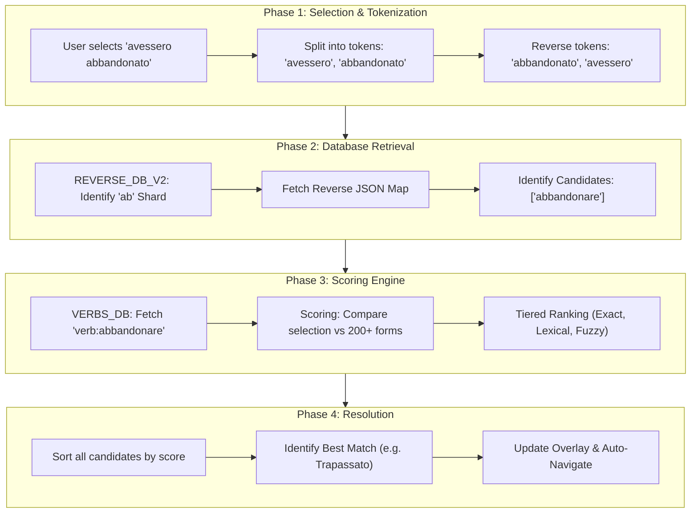

# ConjuMate: Project Master Document

This document provides a comprehensive technical overview of the **ConjuMate** Chrome Extension project. It is designed to be a "single source of truth" for any developer or AI assistant joining the project.

---

## 1. Project Overview
ConjuMate is a Chrome Extension (Manifest V3) providing instant verb conjugations and translations on any webpage. The project consists of two tightly coupled repositories:

- **`LangHover` (Frontend)**: A React/TypeScript Chrome Extension (Internal name: LangHover, Official name: ConjuMate).
- **`gube-proxy` (Backend)**: A Cloudflare Worker (Hono) that handles API requests, database lookups, and translation proxying.

---

## 2. Tech Stack & Environment
### Frontend (Repository: `LangHover`)
- **React 19 / TypeScript / Tailwind CSS 4**
- **Vite 6**: Build tool and local dev server.
- **Packaging**: Built into a structure compatible with Chrome's Manifest V3.

### Backend (`gube-proxy`)
- **Hono**: High-performance web framework for Cloudflare Workers.
- **Cloudflare KV**: Used for the primary verb databases (`VERB_DB`, `REVERSE_DB_V2`).
- **Proxied Services**: DeepL (Free API). (Note: Google Translate and Ultralingua are deprecated/removed.)

---

## 3. Local Development & Setup

### Backend (`gube-proxy`)
1. `npm install`
2. Configure `wrangler.jsonc` or `.dev.vars` with `DEEPL_API_KEY`.
3. Run `npx wrangler dev --remote` (for staging KV data) or `npx wrangler dev` (for local).
4. The worker runs at `http://localhost:8787`.

### Frontend (Repository: `LangHover`)
1. `npm install`
2. `npm run build` (generates the `dist` folder).
3. Load the `dist` folder into Chrome via `chrome://extensions` → "Load unpacked."
4. Use `npm run dev` for rapid component testing in the browser (Note: Overlay features require the built extension).

---

## 4. Core File Registry

| Role | Primary File | Description |
| :--- | :--- | :--- |
| **Logic Root** | `index.tsx` | Universal entry point; routes to Popup (Settings), Dashboard, or Content Script (ExtensionOverlay). |
| **Detection Logic** | `components/ExtensionOverlay.tsx` | Word detection, overlay positioning, routing, and Shadow DOM injection. |
| **Main UI (Conjugation)** | `components/TranslationCard.tsx` | The visual conjugation table and mood/tense navigation interface. |
| **Main UI (Phrase)** | `components/PhraseTranslationCard.tsx` | Card for displaying DeepL phrase/word translations when no conjugation is found. |
| **Backend Engine** | `gube-proxy/src/index.ts` | The core API; handles KV lookups and high-precision scoring. |
| **API Service** | `services/apiService.ts` | Centralized API singleton with multi-language support, error handling, and rate-limit awareness. |
| **Language Config** | `utils/languageConfig.ts` | Language registry, endpoint mappings, DeepL codes, and configuration utilities. |
| **Settings UI** | `components/Settings.tsx` | User interface for source/target language configuration and preferences. |
| **API Config** | `utils/apiConfig.ts` | Environment detection (dev vs. production); resolves the base URL for all API calls. |
| **Legacy Wrappers** | `services/translationService.ts` | Backward-compatibility shim re-exporting from `apiService.ts`. |
| **Legacy Wrappers** | `services/italianConjugationService.ts` | Legacy direct-fetch function for Italian conjugation (superseded by `ApiService`). |
| **Legacy Wrappers** | `utils/languageMapping.ts` | Re-exports from `languageConfig.ts` for backward compatibility. |
| **Dark Mode Hook** | `utils/useDarkMode.ts` | Custom React hook for toggling/persisting dark mode (used by the Dashboard). |
| **Shared Types** | `types.ts` | Centralized TypeScript interfaces for full-stack consistency. |

---

## 5. Architectural Patterns

### The Universal Entry Point (`index.tsx`)
A single React build handles all extension contexts by detecting the environment at runtime:
1. If the page contains `#langhover-dev-root` and the URL contains `?page=dashboard`: mounts the **Dashboard**.
2. If in a Chrome extension context (popup): mounts **Settings**.
3. If in a regular dev server context: mounts **App** (test page).
4. Otherwise (real website): creates a `#langhover-extension-host` div, attaches a Shadow DOM, and mounts **ExtensionOverlay**.

A global flag (`window.__langhoverMounted`) prevents double-mounting when the script runs in both page and content-script contexts on extension-owned pages.

### Shadow DOM Isolation
The extension UI is injected into host pages inside a **Shadow Root** attached to `#langhover-extension-host`. The Tailwind CSS stylesheet is injected separately via a `<link>` tag pointing to `chrome.runtime.getURL('assets/index.css')`. This ensures the extension's styles don't interfere with host website CSS, and vice versa.

### Centralized API Service Architecture
The extension uses a centralized `ApiService` singleton (`services/apiService.ts`) that handles all API communication:

- **Multi-language conjugation lookup**: `lookupConjugation(language, request, signal?)` — dynamic endpoint construction (`/api/{endpoint}/conjugation-lookup`).
- **DeepL translation**: `translateWithDeepL(request, signal?)` — with bidirectional language pair support.
- **Error handling**: Centralized error management with a custom `ApiError` class.
- **Rate limit**: 429 responses are gracefully surfaced to the user ("Free daily limit reached!").
- **Suppressed statuses**: 404 responses from conjugation lookup are logged at `debug` level only (not `error`), to keep the Extensions error tab clean.
- **User ID tracking**: A `gubeUserId` is generated/stored in `chrome.storage.local` and sent as `x-user-id` with DeepL requests.

### Language Configuration System (`utils/languageConfig.ts`)
A comprehensive registry provides:
- **Language definitions**: ISO codes, display names, DeepL codes, API endpoint slugs, and support flags.
- **Currently supported**: Italian (`it`) for conjugation. English, Spanish, French, German, Portuguese, Dutch are registered for translation but marked `isSupported: false` for conjugation.
- **Utility functions**: `isLanguageSupported`, `getDeepLCode`, `getApiEndpoint`, `getSupportedLanguages`, `getAllLanguages`.
- **Defaults**: `DEFAULT_SOURCE_LANGUAGE = 'it'`, `DEFAULT_TARGET_LANGUAGE = 'en'`.

### API URL Resolution (`utils/apiConfig.ts`)
`getApiConfig()` detects environment at runtime:
- **Development**: Returns `http://localhost:8787` when `window.location.hostname` is `localhost`, `127.0.0.1`, a local IP, or includes `dev`/`local`.
- **Chrome Extension Content Script**: When `window.location` is absent, defaults to `http://localhost:8787` (development assumption).
- **Production**: Returns `https://gube-proxy.raunaksbs.workers.dev`.

> **Note**: The production URL embedded in `apiConfig.ts` is `https://gube-proxy.raunaksbs.workers.dev`. The Chrome extension content-script path currently defaults to `localhost`, which means **development mode is ON by default** for the content script context. This must be updated before a production release.

### Intentional Activation & Modifier Key Guard
To prevent intrusive popups, the extension only triggers when a user holds a modifier key (**Ctrl** on Windows/Linux, **Cmd** on macOS) while releasing a mouse button or a key. `isMacOS` is detected via `navigator.platform` and `navigator.userAgent`. If the modifier key is absent and the event is a `mouseup`, the overlay is dismissed.

### Smart Routing Logic (Word Count)
`ExtensionOverlay` applies a two-path routing strategy based on the number of words selected:
- **> 5 words**: Skip conjugation entirely; go directly to `PhraseTranslationCard` via DeepL.
- **≤ 5 words**: Show loading skeleton, attempt conjugation lookup, then decide:
  - If `data.entry` exists → `TranslationCard` (conjugation mode).
  - If not (404 or empty entry) → Fall back to `PhraseTranslationCard` (phrase mode).

### Request Lifecycle Management (`AbortController`)
To prevent race conditions and redundant network traffic, every new selection cancels any in-flight requests via an `AbortController` stored in `abortControllerRef`. Both `lookupConjugation` and `translateWithDeepL` accept an optional `signal` parameter.

### Loading Skeleton
While waiting for API results for ≤ 5-word selections, the overlay immediately renders a shimmer loading skeleton card. This provides instant visual feedback before data arrives.

### Parallel Data Orchestration
Upon a word selection (conjugation path), the extension fires:
1. **Grammar Lookup** (`lookupConjugation`) — started first.
2. **Word Translation** (`translateWithDeepL` for the selected text) — started in parallel.
3. **Infinitive Translation** (`translateWithDeepL` for the resolved infinitive) — started after grammar lookup resolves.

Word and infinitive translations are then awaited together via `Promise.all`.

### Real-time Settings Synchronization
The extension monitors `chrome.storage.onChanged` to apply language and preference changes instantly across all open tabs without requiring a page refresh. Storage key changes on `sourceLang`/`targetLang` (old keys) gracefully migrate to `sourceLanguage`/`targetLanguage` (current keys).

### Storage Key Migration (Backward Compatibility)
Both `Settings.tsx` and `ExtensionOverlay.tsx` read from both `sourceLanguage`/`targetLanguage` (current) and `sourceLang`/`targetLang` (legacy), preferring the current keys. On save, `Settings.tsx` writes both sets of keys to ensure older extension instances remain functional during transition.

### Overlay Positioning & Zoom Correction
`computeCardStyle()` in `ExtensionOverlay` calculates the card's fixed position respecting:
- **Zoom factor**: `window.innerWidth / document.documentElement.getBoundingClientRect().width` to correct for host page zoom.
- **Collision detection**: Renders **above** the selection if there's insufficient space below; otherwise renders below.
- **Horizontal clamping**: Keeps the card within viewport bounds with a 16px margin.

---

## 6. Multi-Language Selection & Extraction Logic
The logic in `ExtensionOverlay.tsx` handles the transition from a user click to a multi-language API request:

1. **Language Configuration**: Loads user-configured `sourceLanguage` and `targetLanguage` from `chrome.storage.local` on mount, with `localStorage` fallback for dev mode.
2. **Word Capture**: Uses `window.getSelection()`. Routes differently based on word count (see Smart Routing Logic above).
3. **Context Extraction**: Uses `range.commonAncestorContainer` to find the parent element. Extracts the surrounding `innerText` (or `textContent` as fallback) as `selectionContext` for the API.
4. **Dynamic API Calls**: Uses `ApiService.lookupConjugation(sourceLanguage, { selection, selectionContext }, signal)`.
5. **Bidirectional Translation**: Translates using DeepL with the configured source/target language pair.
6. **Collision Detection**: Calculates viewportHeight vs. selection position to place the card above or below the text.

---

## 7. The Scoring Engine
Located in `gube-proxy/src/index.ts` (`scoreStoredForm`), this tiered system ranks candidate conjugations to find the "best" match for the user's selection.

- **Tier 1: Exact Matches (1000+)**: Perfect string match between selection and database form.
- **Tier 2: Context Prefix Matches (1025)**: Matches for "che + verb" specifically for Italian subjunctive forms.
- **Tier 3: Lexical Matches (900+)**: Matches after removing pronouns or noise tokens (e.g., matching "parlo" against "io parlo").
- **Tier 4: Accentless Matches (800+)**: Fallback for mismatched pedagogical or phonological accents.

### UI Highlighting Logic
The `TranslationCard` uses a two-tier highlighting priority:
1. **`initialMatch` (primary)**: Matches the exact stored form from the backend (`value === initialMatch.storedForm`) within the correct mood/tense. Highlighted with `font-bold text-indigo-600 underline`.
2. **Visual match (fallback)**: If no `initialMatch` data is available, falls back to a string comparison: `value.toLowerCase().split(/[\s\/]+/).some(part => part === cleanWord)`.

---

## 8. Database Schema (Cloudflare KV)

### `REVERSE_DB_V2` (Reverse Lookup)
- **Strategy**: Sharded by the first two characters of the normalized token.
- **Key**: `it:rev:v2:norm:[prefix]` (e.g., `it:rev:v2:norm:ab`).
- **Value**: A JSON map of `{ "conjugated_form": ["infinitive"] }`.

### `VERBS_DB` / `VERB_DB` (Master Data)
- **Key**: `verb:[infinitive]` (e.g., `verb:abalienare`).
- **Data**: A nested JSON object containing all moods and tenses.
- **Storage Strategy**: Stores **full prefixed strings** (e.g., `"io ho parlato"`) instead of stems. This allows the scoring engine to perform high-priority exact matches and context-prefix matches.

---

## 9. Search & Scoring Flow
This diagram illustrates the step-by-step process of how the extension resolves a user's selection into a specific verb conjugation.



---

## 10. Multi-Language API & Data Flow

```mermaid
graph TD
    UserSelection[User Selects Word] --> Detection[ExtensionOverlay detects selection]
    Detection --> WordCount{Word Count?}
    
    WordCount -->|"> 5 words"| PhraseOnly[Direct Phrase Translation]
    WordCount -->|"≤ 5 words"| LoadingState[Show Loading Skeleton]
    
    LoadingState --> LoadConfig[Load language preferences from storage]
    LoadConfig --> Context[Extract context & word]
    
    subgraph "Multi-Language API Layer"
        Context --> LanguageValidation[Validate source language support]
        LanguageValidation --> ConjugationAPI[Dynamic Conjugation API /api/{language}/conjugation-lookup]
        Context --> TranslationAPI[DeepL Proxy /api/deepl]
    end
    
    ConjugationAPI -->|"entry found"| GrammaticalInfo[Language-specific Mood, Tense, Person, Infinitive]
    ConjugationAPI -->|"404 / no entry"| PhraseOnly
    TranslationAPI --> FinalTranslations[Source → Target translations]
    
    GrammaticalInfo --> UI[TranslationCard renders conjugation table]
    FinalTranslations --> UI
    PhraseOnly --> PhraseCard[PhraseTranslationCard renders translation]
    
    subgraph "Configuration Management"
        Settings[User Settings Component] --> Storage[Chrome Storage]
        Storage --> LoadConfig
        LanguageRegistry[Language Config Registry] --> LanguageValidation
        LanguageRegistry --> TranslationAPI
    end
```

---

## 11. Multi-Language Expansion Architecture

### Backend Language Registry
The backend (`gube-proxy`) uses a centralized `LanguageConfig` registry that defines:
- **Noise Tokens**: Language-specific pronouns and particles (e.g., `io`, `tu`, `che`).
- **Mood Order**: The preferred display order for grammatical moods and tenses.
- **Lookup Strategies**: Sharding prefixes and transformation rules for database queries.

### Dynamic Database Routing
The backend dynamically routes requests to the appropriate Cloudflare KV namespaces:
- **Italian**: Uses `VERB_DB` and `REVERSE_DB_V2`.
- **Other Languages**: Dynamically resolves to `VERBS_DB_[LANG]` and `REVERSE_DB_[LANG]` based on the request path.

### Unicode-Aware Processing
All tokenization and sanitization pipelines use Unicode-aware regular expressions (`\p{L}`), ensuring that accented characters and special letters (e.g., `ñ`, `ß`, `é`) are preserved and handled correctly across all European languages.

### User Experience
- **Language Selection**: Source and target language configuration in the Settings popup.
- **Storage Persistence**: Language preferences saved in `chrome.storage.local` under `sourceLanguage` / `targetLanguage`.
- **Real-time Switching**: Language changes apply immediately to new selections via `chrome.storage.onChanged`.
- **Backward Compatibility**: Old keys (`sourceLang`, `targetLang`) are read during migration.

### Future Roadmap
- **Progressive Language Rollout**: Enable languages as backend endpoints become available.
- **Language Detection**: Potential automatic source language detection.
- **Additional Translation Services**: Integration with other translation providers.
- **Advanced Grammar**: Language-specific grammar rules and exceptions.

---

## 12. Component Inventory

| Component | File | Purpose |
| :--- | :--- | :--- |
| `ExtensionOverlay` | `components/ExtensionOverlay.tsx` | Root content-script component. Listens for Ctrl/Cmd+select, routes requests, manages state. |
| `TranslationCard` | `components/TranslationCard.tsx` | Conjugation table. Mood/tense navigation. Form highlighting. Alternative infinitives footer. |
| `PhraseTranslationCard` | `components/PhraseTranslationCard.tsx` | Simple translation card for phrases and single words not found in the conjugation database. |
| `Settings` | `components/Settings.tsx` | Extension popup UI for selecting source/target languages. |
| `Dashboard` | `dashboard.tsx` | Full-page management UI (stats, settings, dark mode). Uses `useDarkMode` hook. |
| `App` | `App.tsx` | Dev-mode test page rendered locally via `npm run dev`. |

---

## 13. Stability, Safety & Security

### Context Invalidation Safety
Chrome extensions frequently lose their execution context when reloaded or updated. Both `ExtensionOverlay.tsx` and `apiService.ts` implement `isContextValid()` checks (`chrome.runtime && chrome.runtime.id`) to prevent the "Extension context invalidated" error. The service falls back to `localStorage` and `crypto.randomUUID()` instead of crashing.

### Dual-Limit Validation
To protect backend resources and handle different use cases:
- **Conjugation Search**: Restricted to selections of **≤ 5 words** (enforced in `ExtensionOverlay`).
- **General Translation (Phrase)**: Supports longer selections — sent directly to DeepL for selection > 5 words.

### CORS Lockdown
The backend implementation includes an origin-lockdown middleware. If the `ALLOWED_EXTENSION_ID` environment variable is set, the API will only accept requests originating from that specific Chrome extension ID, preventing unauthorized third-party usage.

### 404 Noise Suppression
`ApiService.lookupConjugation` treats HTTP 404 as an expected "no match found" outcome. It logs at `console.debug` level instead of `console.error` to keep the Extensions error tab clean.

---

## 14. Pre-Launch Checklist & Configuration

### 🚀 **Production Deployment Steps**

#### **Environment Configuration**
1. **Fix Content-Script URL Resolution**:
   The `apiConfig.ts` currently defaults the Chrome extension content-script context to `localhost`. Before production, ensure the fallback path returns the production URL:
   ```typescript
   // In utils/apiConfig.ts — remove or guard the content-script fallback:
   // This block currently forces dev mode for all content scripts:
   if (typeof window !== 'undefined' && !window.location) {
     // CHANGE: return production URL instead of localhost
     return {
       baseUrl: 'https://gube-proxy.raunaksbs.workers.dev',
       environment: 'production'
     };
   }
   ```

2. **Verify Production Backend**:
   - Ensure `https://gube-proxy.raunaksbs.workers.dev` is deployed and accessible.
   - Test all API endpoints: `/api/italian/conjugation-lookup`, `/api/deepl`.
   - Verify DeepL API integration is working.

#### **Chrome Extension Preparation**
1. **Update Manifest**:
   - Verify `manifest.json` has correct permissions.
   - Ensure production host permissions are included.
   - Update extension name, description, and version.

2. **Build Optimization**:
   - Run `npm run build` to generate production bundle.
   - Verify no development dependencies are included.
   - Test built extension in Chrome.

3. **Testing Checklist**:
   - ✅ Italian conjugation lookup works.
   - ✅ DeepL translation works (Italian ↔ English).
   - ✅ Phrase translation fallback works (> 5 words).
   - ✅ Loading skeleton appears before data arrives.
   - ✅ Settings page saves language preferences.
   - ✅ Extension loads without console errors.
   - ✅ All API calls use production URLs.

#### **Security & Performance**
1. **API Key Management**:
   - Ensure DeepL API keys are properly secured in backend.
   - No API keys exposed in frontend code.
   - Rate limiting implemented on the backend.

2. **CORS Configuration**:
   - Backend allows requests from `chrome-extension://` origins.
   - `ALLOWED_EXTENSION_ID` set in Cloudflare Worker environment.

### 🛠️ **Development Mode**
The extension automatically uses `http://localhost:8787` when running via `npm run dev`. For content-script testing with the built extension, also run `npx wrangler dev --remote` in the `gube-proxy` directory.

### 📋 **Launch Day Checklist**
- [ ] Content-script URL fallback fixed (points to production)
- [ ] Production backend deployed and tested
- [ ] Extension built and tested
- [ ] Chrome Web Store listing prepared
- [ ] Documentation updated
