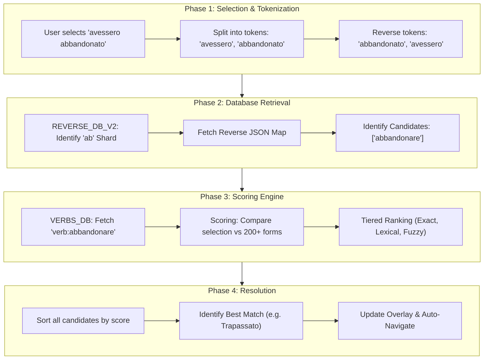

# ConjuMate: Project Master Document

This document provides a comprehensive technical overview of the **ConjuMate** Chrome Extension project. It is designed to be a "single source of truth" for any developer or AI assistant joining the project.

---

## 1. Project Overview
ConjuMate is a Chrome Extension (Manifest V3) providing instant Italian verb conjugations and translations on any webpage. The project consists of two tightly coupled repositories:

- **`LangHover` (Frontend)**: A React/TypeScript Chrome Extension.
- **`gube-proxy` (Backend)**: A Cloudflare Worker (Hono) that handles API requests, database lookups, and translation proxying.

---

## 2. Tech Stack & Environment
### Frontend (`ConjuMate`)
- **React 19 / TypeScript / Tailwind CSS 4**
- **Vite 6**: Build tool and local dev server.
- **NLP**: Uses `compromise` for basic text analysis.
- **Packaging**: Built into a structure compatible with Chrome's Manifest V3.

### Backend (`gube-proxy`)
- **Hono**: High-performance web framework for Cloudflare Workers.
- **Cloudflare KV**: Used for the primary verb databases (`VERB_DB`, `REVERSE_DB_V2`).

- **Proxied Services**: DeepL (Free API), Google Translate. (Note: Ultralingua is deprecated).

---

## 3. Local Development & Setup

### Backend (`gube-proxy`)
1. `npm install`
2. Configure `wrangler.jsonc` or `.dev.vars` with `DEEPL_API_KEY` and `GOOGLE_API_KEY`.
3. Run `npx wrangler dev` (Runs at `http://localhost:8787`).
4. Ensure local KV data is present or use `--remote` for staging data.

### Frontend (`ConjuMate`)
1. `npm install`
2. `npm run build` (generates the `dist` folder).
3. Load the `dist` folder into Chrome via `chrome://extensions` -> "Load unpacked."
4. Use `npm run dev` for rapid component testing in the browser (Note: Overlay features require the built extension).

---

## 4. Core File Registry

| Role | Primary File | Description |
| :--- | :--- | :--- |
| **Logic Root** | `index.tsx` | Universal entry point; routes to Popup, Dashboard, or Content Script. |
| **Detection Logic** | `components/ExtensionOverlay.tsx` | Multi-language word detection, positioning, and Shadow DOM injection. |
| **Main UI** | `components/TranslationCard.tsx` | The visual conjugation table and navigation interface. |
| **Backend Engine** | `gube-proxy/src/index.ts` | The core API; handles KV lookups and high-precision scoring. |
| **API Service** | `services/apiService.ts` | Centralized API service with multi-language support and error handling. |
| **Language Config** | `utils/languageConfig.ts` | Language registry, endpoint mappings, and configuration management. |
| **Settings UI** | `components/Settings.tsx` | User interface for language configuration and preferences. |
| **Legacy API Wrappers** | `services/translationService.ts` | Backward compatibility layer for translation services. |
| **Shared Types** | `types.ts` | Centralized TypeScript interfaces for full-stack consistency. |

---

## 5. Architectural Patterns

### The Universal Entry Point (`index.tsx`)
A single React build handles all extension contexts by detecting the environment at runtime. It mounts the **Settings** (for the popup), the **Dashboard** (for management), or the **ExtensionOverlay** (inside a Shadow DOM on host pages).

### Shadow DOM Isolation
The extension UI is injected into host pages inside a **Shadow Root**. This ensures that the extension's Tailwind styles do not interfere with the host website's CSS, and vice-versa.

### Centralized API Service Architecture
The extension uses a centralized `ApiService` singleton pattern that handles all API communication:

- **Multi-language conjugation lookup**: Dynamic endpoint construction (`/api/{language}/conjugation-lookup`)
- **Language validation**: Ensures only supported languages are used
- **Bidirectional translation**: Support for any language pair via DeepL
- **Error handling**: Centralized error management with custom `ApiError` class
- **Configuration management**: Environment-based URL configuration with fallbacks

### Language Configuration System
A comprehensive language registry (`languageConfig.ts`) provides:

- **Language definitions**: ISO codes, display names, DeepL codes, API endpoints
- **Support flags**: Mark languages as supported or "coming soon"
- **Utility functions**: Language validation, endpoint resolution, code mapping
- **User preferences**: Chrome storage integration for language settings

### Intentional Activation & Control
To prevent intrusive popups, the extension only triggers when a user holds a modifier key (**Ctrl** on Windows/Linux, **Cmd** on macOS) while selecting text. This ensures the overlay appears only when explicitly desired.

### Request Lifecycle Management (`AbortController`)
To prevent race conditions and redundant network traffic, the extension implements an `AbortController` pattern. Any ongoing API requests are immediately cancelled if the user makes a new selection, ensuring the UI always reflects the most recent intent.

### Parallel Data Orchestration
Upon a word selection, the extension triggers multiple asynchronous processes simultaneously using `Promise.all`:
1.  **Grammar Lookup**: Identifying the verb, mood, tense, and person.
2.  **Word Translation**: Fetching the meaning of the selected token via DeepL.
3.  **Infinitive Translation**: Fetching the meaning of the resolved infinitive.

### Real-time Settings Synchronization
The extension monitors `chrome.storage.onChanged` to apply language and preference changes instantly across all open tabs without requiring a page refresh.

---

## 6. Multi-Language Selection & Extraction Logic
The logic in `ExtensionOverlay.tsx` handles the transition from a user click to a multi-language API request:

1.  **Language Configuration**: Loads user-configured source/target languages from Chrome storage
2.  **Word Capture**: Uses `window.getSelection()`. Ignores selections longer than 2 words to maintain performance.
3.  **Context Extraction**: Uses `range.commonAncestorContainer` to find the parent element. It extracts the surrounding `innerText` to help the AI/Translation layers disambiguate word meanings.
4.  **Dynamic API Calls**: Uses `ApiService.lookupConjugation(sourceLanguage, request)` for language-specific conjugation lookup
5.  **Bidirectional Translation**: Translates from source language to target language using configurable language pairs
6.  **Collision Detection**: Calculates `viewportHeight` vs. selection position to decide if the card should appear above or below the highlighted text.

---

## 7. The Scoring Engine
Located in `gube-proxy/src/index.ts` (`scoreStoredForm`), this tiered system ranks candidate conjugations to find the "best" match for the user's selection.

- **Tier 1: Exact Matches (1000+)**: Perfect string match between selection and database form.
- **Tier 2: Context Prefix Matches (1025)**: Matches for "che + verb" specifically for Italian subjunctive forms.
- **Tier 3: Lexical Matches (900+)**: Matches after removing pronouns or noise tokens (e.g., matching "parlo" against "io parlo").
- **Tier 4: Accentless Matches (800+)**: Fallback for mismatched pedagogical or phonological accents.

### UI Highlighting Logic
The `TranslationCard` prioritizes the `initialMatch` data returned by the backend to highlight the exact form found in the database. It falls back to a visual string match only when metadata is unavailable, ensuring maximum linguistic precision.

---

## 8. Database Schema (Cloudflare KV)

### `REVERSE_DB_V2` (Reverse Lookup)
- **Strategy**: Sharded by the first two characters of the normalized token.
- **Key**: `it:rev:v2:norm:[prefix]` (e.g., `it:rev:v2:norm:ab`).
- **Value**: A JSON map of `{ "conjugated_form": ["infinitive"] }`.

### `VERBS_DB` (Master Data)
- **Key**: `verb:[infinitive]` (e.g., `verb:abalienare`).
- **Data**: A nested JSON object containing all moods and tenses.
- **Storage Strategy**: Stores **full prefixed strings** (e.g., `"io ho parlato"`) instead of stems. This allows the scoring engine to perform high-priority## 9. Search & Scoring Flow
This diagram illustrates the step-by-step process of how the extension resolves a user's selection into a specific verb conjugation.



---

## 10. Multi-Language API & Data Flow

```mermaid
graph TD
    UserSelection[User Selects Word] --> Detection[ExtensionOverlay detects selection]
    Detection --> LoadConfig[Load language preferences from storage]
    LoadConfig --> Context[Extract context & word]
    
    subgraph "Multi-Language API Layer"
        Context --> LanguageValidation[Validate source language support]
        LanguageValidation --> ConjugationAPI[Dynamic Conjugation API /api/{language}/conjugation-lookup]
        Context --> TranslationAPI[Bidirectional DeepL Proxy /api/deepl]
    end
    
    ConjugationAPI --> GrammaticalInfo[Language-specific Mood, Tense, Person, Infinitive]
    TranslationAPI --> FinalTranslations[Source → Target translations]
    
    GrammaticalInfo --> UI[TranslationCard renders with language context]
    FinalTranslations --> UI
    
    subgraph "Configuration Management"
        Settings[User Settings Component] --> Storage[Chrome Storage]
        Storage --> LoadConfig
        LanguageRegistry[Language Config Registry] --> LanguageValidation
        LanguageRegistry --> TranslationAPI
    end
```

---

## 11. Multi-Language Expansion Architecture

### Backend Language Registry
The backend (`gube-proxy`) uses a centralized `LanguageConfig` registry that defines:
- **Noise Tokens**: Language-specific pronouns and particles (e.g., `io`, `tu`, `che`).
- **Mood Order**: The preferred display order for grammatical moods and tenses.
- **Lookup Strategies**: Sharding prefixes and transformation rules for database queries.

### Dynamic Database Routing
The backend dynamically routes requests to the appropriate Cloudflare KV namespaces:
- **Italian**: Uses `VERB_DB` and `REVERSE_DB_V2`.
- **Other Languages**: Dynamically resolves to `VERBS_DB_[LANG]` and `REVERSE_DB_[LANG]` based on the request path.

### Unicode-Aware Processing
All tokenization and sanitization pipelines use Unicode-aware regular expressions (`\p{L}`), ensuring that accented characters and special letters (e.g., `ñ`, `ß`, `é`) are preserved and handled correctly across all European languages.

### User Experience
- **Language Selection**: Source and target language configuration in settings
- **Storage Persistence**: Language preferences saved in Chrome storage
- **Real-time Switching**: Language changes apply immediately to new selections
- **Backward Compatibility**: Existing Italian functionality remains unchanged

### Future Roadmap
- **Progressive Language Rollout**: Enable languages as backend endpoints become available
- **Language Detection**: Potential automatic source language detection
- **Additional Translation Services**: Integration with other translation providers
- **Advanced Grammar**: Language-specific grammar rules and exceptions

---

## 13. Stability, Safety & Security

### Context Invalidation Safety
Chrome extensions frequently lose their execution context when reloaded or updated. Both `ExtensionOverlay.tsx` and `apiService.ts` implement `isContextValid()` checks to prevent the "Extension context invalidated" error, ensuring the script fails gracefully or falls back to `localStorage` instead of crashing.

### Dual-Limit Validation
To protect backend resources and handle different use cases:
- **Conjugation Search**: Restricted to selections under 50 characters to ensure high-precision verb matching.
- **General Translation**: Supports longer selections up to 500 characters.

### CORS Lockdown
The backend implementation includes an origin-lockdown middleware. If the `ALLOWED_EXTENSION_ID` environment variable is set, the API will only accept requests originating from that specific extension ID, preventing unauthorized third-party usage.

---

## 14. Pre-Launch Checklist & Configuration

### 🚀 **Production Deployment Steps**

#### **Environment Configuration**
1. **Disable Development Override**:
   ```typescript
   // In utils/apiConfig.ts, comment out the manual override:
   // console.log('[API Config] MANUAL OVERRIDE: Forcing development mode');
   // return { baseUrl: 'http://localhost:8787', environment: 'development' };
   ```

2. **Verify Production Backend**:
   - Ensure `https://gube-proxy.raunaksbs.workers.dev` is deployed and accessible
   - Test all API endpoints: `/api/italian/conjugation-lookup`, `/api/deepl`
   - Verify DeepL API integration is working

3. **Update Production URLs** (if needed):
   ```typescript
   // In utils/apiConfig.ts, update production URL if different:
   return {
     baseUrl: 'https://gube-proxy.raunaksbs.workers.dev',
     environment: 'production'
   };
   ```

#### **Chrome Extension Preparation**
1. **Update Manifest**:
   - Verify `manifest.json` has correct permissions
   - Ensure production host permissions are included
   - Update extension name, description, and version

2. **Build Optimization**:
   - Run `npm run build` to generate production bundle
   - Verify no development dependencies are included
   - Test built extension in Chrome

3. **Testing Checklist**:
   - ✅ Italian conjugation lookup works
   - ✅ DeepL translation works (Italian ↔ English)
   - ✅ Settings page saves language preferences
   - ✅ Extension loads without console errors
   - ✅ All API calls use production URLs

#### **Security & Performance**
1. **API Key Management**:
   - Ensure DeepL API keys are properly secured in backend
   - No API keys exposed in frontend code
   - Rate limiting implemented

2. **CORS Configuration**:
   - Backend allows requests from chrome-extension:// origins
   - Proper CORS headers configured

3. **Error Handling**:
   - Graceful degradation when API is unavailable
   - User-friendly error messages
   - Proper logging for debugging

#### **Final Verification**
1. **Multi-language Support**:
   - Italian conjugation fully functional
   - Translation between Italian and English working
   - Settings UI properly configured

2. **User Experience**:
   - Extension loads quickly
   - UI is responsive and functional
   - Settings persist correctly

3. **Production Readiness**:
   - All development code removed/commented
   - Environment detection working correctly
   - Backend endpoints stable and performant

### 🛠️ **Development Mode Toggle**

For future development, use the manual override in `utils/apiConfig.ts`:

```typescript
export const getApiConfig = (): ApiConfig => {
  // MANUAL OVERRIDE: Force development mode for testing
  // Uncomment for development, comment out for production
  console.log('[API Config] MANUAL OVERRIDE: Forcing development mode');
  return {
    baseUrl: 'http://localhost:8787',
    environment: 'development'
  };
  
  // Production logic (active when override is commented out)
  // ... rest of environment detection code
};
```

### 📋 **Launch Day Checklist**
- [ ] Development override commented out
- [ ] Production backend deployed and tested
- [ ] Extension built and tested
- [ ] Chrome Web Store listing prepared
- [ ] Documentation updated
- [ ] User guide created
- [ ] Support channels established
